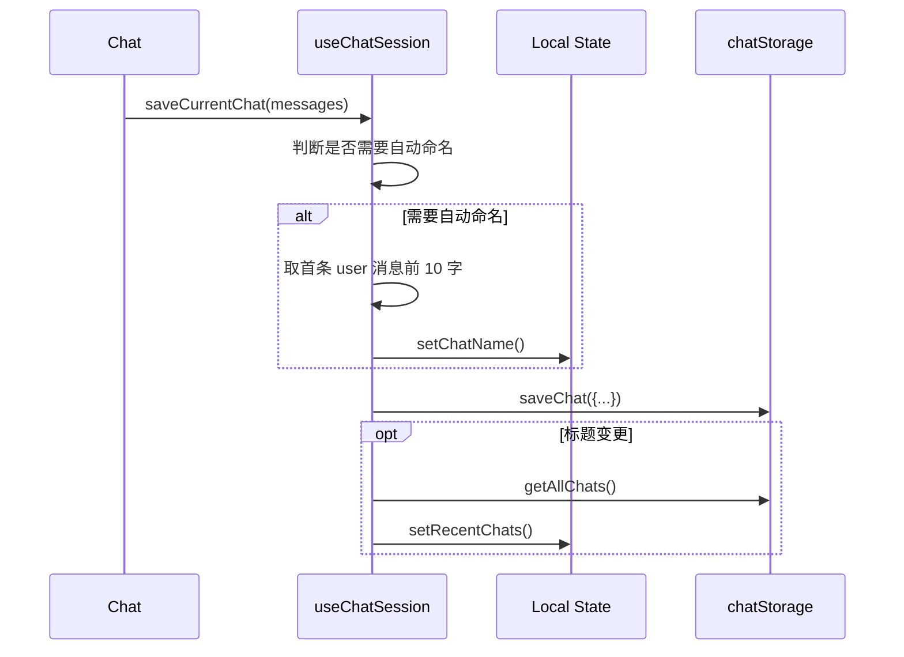

# Chat 会话持久化与同步方案说明

> 更新时间：2025-06-03

本文档记录 **当前版本**（Zustand 迁移之前）中 *聊天（Chat）* 的数据模型、状态流转以及持久化方案，供后续维护或重构时参考。

---

## 1. 数据模型

```ts
// src/services/chatStorage.ts 中定义
export interface ChatSession {
  id: string;            // UUID，聊天唯一标识
  name: string;          // 聊天标题
  lastUpdated: number;   // 最后更新时间，毫秒时间戳
  messages: DisplayMessage[]; // 全量消息记录
  modelId?: string;      // 生成该聊天使用的模型（可选）
}
```

- `DisplayMessage` 位于 `@/components/chat/ChatMessage`，表示单条消息。
- 所有聊天会话序列化后存储在 **IndexedDB**（idb 库封装）。

---

## 2. 存储层（chatStorage）

封装了 CRUD 操作：

| 方法 | 说明 |
|------|------|
| `saveChat(chat: ChatSession)` | 新建 / 更新会话 |
| `getChat(id)` | 读取单个会话 |
| `getAllChats()` | 读取全部会话，用于侧边栏 |
| `updateChatName(id, name)` | 仅更新标题（IndexedDB `put`） |
| `deleteChat(id)` | 删除会话 |

> IndexedDB 名称：`ollama-chat-db`，对象仓库：`chats`（keyPath=`id`）。

---

## 3. 状态层（useChatSession）

文件：`src/hooks/useChatSession.ts`

### 3.1 内部状态

| state | 作用 |
|-------|------|
| `currentChatId` | 当前激活的聊天 ID（来自 URL 参数或新建） |
| `chatName` | 当前聊天标题（随 `loadChat / renameChat` 更新） |
| `recentChats` | 最近聊天列表（`getAllChats()` 结果） |
| `isLoading` | 全局加载指示 |
| `hasNamedCurrentChat` | 当前会话是否已被命名（用于自动命名逻辑） |

### 3.2 生命周期

1. **初始化**：`useEffect` → 调用 `getAllChats()`，填充 `recentChats`。
2. **解析 URL**：监听 `searchParams`，若包含 `chatId` 调 `loadChat(chatId)`。
3. **新建**：`createNewChat()` 生成 UUID → 空会话立即 `saveChat` → 推路由 `/?chatId=ID`。
4. **加载**：`loadChat(id)` 读 IndexedDB → 设置本地状态 → 返回消息数组供组件渲染。

### 3.3 保存逻辑（saveCurrentChat）

触发时机：

- `Chat` 组件内 **消息数量变化** 或 **流式回复完成** 后调用。

核心流程：



说明：

1. **自动命名**：若会话标题仍为"未命名"且捕获到首条 user 消息，就截取前 10 个字符作为标题。
2. 保存成功后，如有自动命名，重新拉取全部会话刷新侧边栏。

### 3.4 重命名逻辑（renameChat）

1. 调用 `chatStorage.updateChatName()` 更新 IndexedDB。  
2. 若是当前激活会话，同步 `chatName` state。  
3. 始终重新加载 `getAllChats()` → 刷新侧边栏。  
4. 通过 **事件总线** `eventService.publish({type:"CHAT_RENAMED"})` 广播，其他页面（如 SidebarNav）订阅并触发 `refreshRecentChats()`，以防遗漏。

### 3.5 其他操作

- **删除**：`removeChat` → IndexedDB 删除 → 若删除当前会话则自动 `createNewChat()`。
- **手动刷新**：`refreshRecentChats()` 供 UI 按钮调用，简单拉取一次全部列表。

---

## 4. 事件总线（eventService）

- 纯内存发布 / 订阅模式。  
- 当前仅用于聊天重命名 / 创建 / 删除后，通知侧边栏进行刷新。

---

## 5. 优点 & 局限

### 优点

1. **实现简单**：纯 React hook + IndexedDB，无额外全局 store。  
2. **离线持久化**：全部数据保存在浏览器端，可离线访问。

### 局限

1. **多副本状态**：每个挂载 `useChatSession` 的组件都维护独立 `recentChats` 副本，需要靠事件总线 + 重新拉取确保一致。  
2. **额外 I/O**：聊天重命名等简单动作，需要多次访问 IndexedDB。  
3. **跨组件同步延迟**：事件监听与拉取存在毫秒级延迟，理论上可能出现短暂不一致。

---

## 6. 后续改进方向

1. **统一全局状态**：参考知识库已采用的 `useLibraryStore`，将聊天元数据迁移到 `Zustand useChatStore`。  
2. **拆分大数据**：
   - **元数据（id, name, lastUpdated）** 放全局 store。  
   - **大体量 messages** 使用按需 hook `useMessages(chatId)`，避免全量入 store 导致性能问题。  
3. **可选跨标签页同步**：在 store middleware 中接入 `BroadcastChannel` 广播，实现多标签自动同步。

---

> 如需修改或重构保存逻辑，请先阅读本文件，确保理解现有依赖链。 